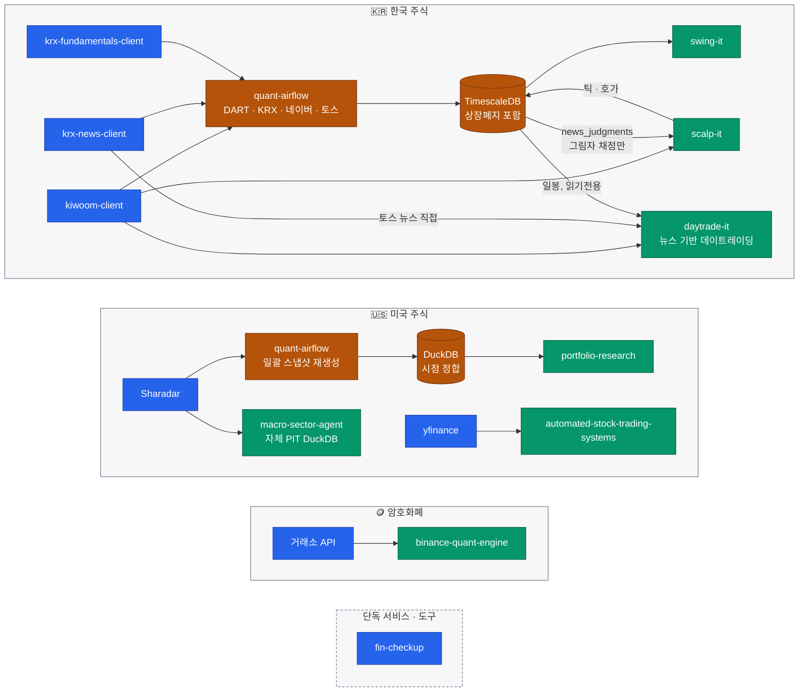
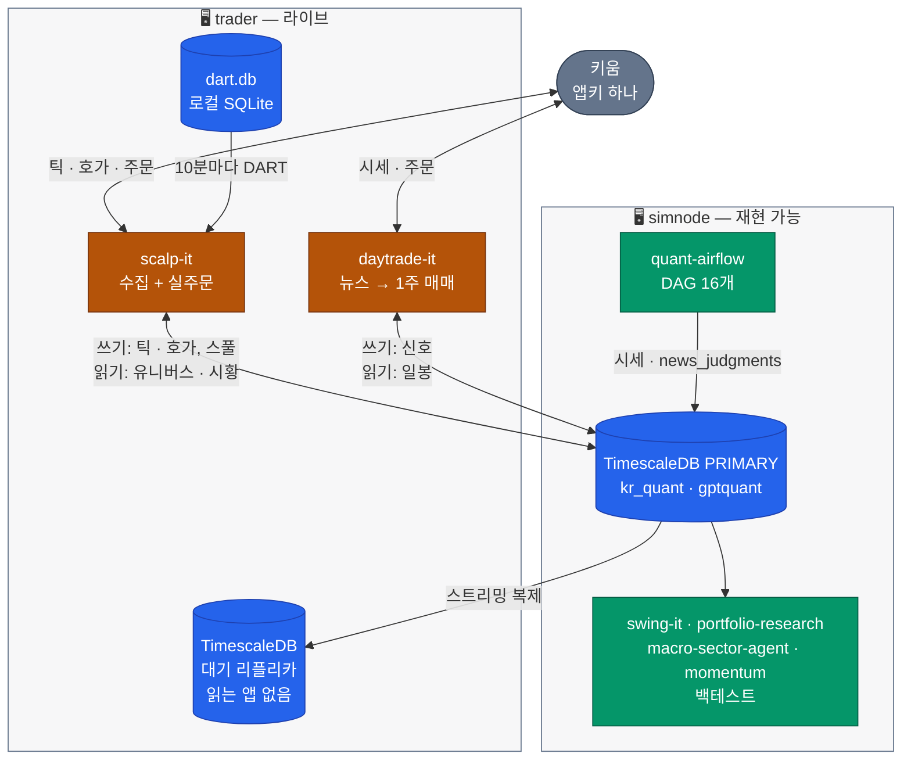
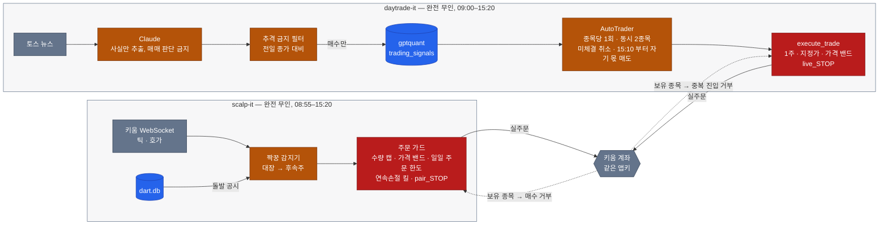

<h1 align="center">Younghwan Chae, Ph.D. · 채영환</h1>

  <b>기계공학 박사</b> &nbsp;—&nbsp; <b><i>수치 최적화</i></b> &nbsp;·&nbsp; <b>두산로보틱스</b> ML · 인지 엔지니어 
<b>학위 때부터 붙잡고 있는 건 결국 최적화 하나다.</b> 수치 최적화와 대리모델, 상태추정으로 시작해 지금은 3D 인지와 센서 퓨전, 양산 시스템에 그걸 쓴다.

<b>한국어</b> · <a href="README.md">English</a>

  
  
  

---

<h3></h3>

세 스택이 같은 뼈대를 쓴다. **수집하고, 저장하고, 그 위에서만 검증한다.**
두 주식 시장은 Airflow 하나를 나눠 쓰고, 단독으로 도는 서비스들은 파이프라인 바깥에 있다.

파랑은 데이터 원천과 단독 서비스, 앰버는 수집·저장, 초록은 리서치·엔진이다. 점선은 파이프라인 바깥을 뜻한다.

| 프로젝트 | 무엇인가 |
|---|---|
| **[kiwoom-client](https://github.com/younghwan91/kiwoom-client)**  | 키움증권 REST API 를 파이썬으로 감싼 라이브러리. 국내주식 엔드포인트를 빠짐없이 덮고 실시간 WebSocket 도 받는다. sync 와 async 를 모두 지원하고 토큰은 알아서 갱신한다. 예전 OpenAPI+ 처럼 32bit 윈도우에 묶이지 않아 리눅스 서버에서 그대로 돈다. REST 엔드포인트 182개와 `condition_search` 를 통째로 노출하는 **MCP 서버**도 들어 있어 AI 에이전트가 바로 도구로 쓸 수 있다 — 실주문은 옵트인일 때만 · **`pip install kiwoom-client`**  |
| **[quant-airflow](https://github.com/younghwan91/quant-airflow)**  | 두 주식 스택에 데이터를 대는 파이프라인 — DAG 16개. 한국 쪽은 시세·수급·실적·컨센서스·상장주식수·뉴스공시(krx-fundamentals-client·krx-news-client 경유)를 DART·키움·KRX·네이버·토스에서 모아 TimescaleDB 에 쌓는다. **상장폐지 종목까지 되살려 담기 때문에** 이 데이터로 만든 백테스트는 생존편향에 빠지지 않는다. 그 뉴스·공시 스트림을 LLM이 구조화 판단(이벤트 유형·감성·재탕 여부)으로 바꿔 `news_judgments` 에 남긴다 — scalp-it 은 이걸 그림자로만 채점하고, 주문에는 닿지 않는다. 미국 쪽은 Sharadar 스냅샷을 매일 통째로 받아 DuckDB 스토어를 새로 만든 뒤 한 번에 갈아끼운다 |
| **[krx-fundamentals-client](https://github.com/younghwan91/krx-fundamentals-client)**  | 국내 기업 펀더멘탈 Python 클라이언트 라이브러리. 재무제표(최대 100종목씩 배치 조회)와 투자지표, 배당, 종목 스크리닝을 DART·KRX·네이버에서 모아 정규화한다. 상시 서버 없이 호출 시점에 소스에 직접 요청한다 · quant-airflow 의 실적·주식수·컨센서스 DAG 가 이걸 쓴다 |
| **[krx-news-client](https://github.com/younghwan91/krx-news-client)**  | 한국 주식 뉴스와 공시를 모아 주는 Python 클라이언트 라이브러리 — DART 공시 + 토스증권 뉴스. 매체마다 같은 사건을 조금씩 다르게 쓰는데, 그걸 한 스키마로 눕혀서 내준다 · quant-airflow 의 `daily_news` DAG 가 이걸 쓴다 · **`pip install krx-news-client`**  |
| **[fin-checkup](https://github.com/younghwan91/fin-checkup)**  | 관심 종목에 유상증자·전환사채·감사의견·상장폐지 같은 위험 공시가 뜨면 텔레그램으로 알린다. 재무 17개 지표는 작년 값, 업종 중앙값, 동종업계 백분위와 나란히 놓아 신호등으로 보여준다. DART 와 SEC 양쪽을 본다. **재무 수치와 사실만 전하고 종목 추천은 하지 않는다** |
| **[swing-it](https://github.com/younghwan91/swing-it)**  | 코스피·코스닥 스윙 리서치. 두 축을 일부러 떼어 뒀다. **관측** 쪽은 섹터별로 돈이 어디로 들고 났는지 5~120거래일 구간으로 보여주는 터미널 화면 `sw-flow` 와, 그 밑의 주체×섹터 원장을 그대로 펼친 `sw-ledger` 다. 잰 값만 보여주고 예측은 하지 않는다. **심사** 쪽은 알파를 개별 트레이드 분포로 판정한다. walk-forward, 랜덤 음성대조, purged CV, Deflated Sharpe, 생존편향 보정 유니버스를 **CI 가 전부 검사하므로 빠뜨릴 수가 없다**. **여기서 나오는 건 대개 기각이고, 그게 이 저장소의 산출물이다.** 아무 신호도 없는 난수가 “6폴드 중 5폴드 양수”를 46% 확률로 통과하니, 판별 기준은 폴드 개수가 아니라 자기 자신의 무작위 버전을 이기느냐다. 알파 가설 6건 중 5건을 기각했고 통과한 건 PEAD 하나다. 옛 이름 `kr-quant` |
| **[portfolio-research](https://github.com/younghwan91/portfolio-research)**  | 미국주식 팩터 엔진. 시점이 어긋나지 않고 생존편향을 보정한 데이터 위에서만 walk-forward 를 돌리고, 그 결과를 **Deflated Sharpe 와 PBO** 로 거른다. ETF 전술배분도 같이 검증한다. **통과한 것만 싣지는 않는다.** 사전등록한 TAA 9건은 전부 PBO 관문을 못 넘었고, 표제로 쓰던 숫자 하나는 스스로 철회했다 · [writeup](https://younghwan91.github.io/portfolio-research/) |
| **[macro-sector-agent](https://github.com/younghwan91/macro-sector-agent)**  | 하향식으로 미국 산업 테마를 찾는 리서치 파이프라인 — 자체 Sharadar 기반 시점정합 DuckDB 위에서 돈다. “지금 뭘 사야 하나”가 아니라 “**지금 어느 산업이 잊혔나**”를 먼저 묻는다. 표준 섹터 분류로는 안 보이는 해상도로 시장을 쪼갠다. 사이클 저점인지 그냥 죽어가는 산업인지는 LLM 판별기가 증거를 놓고 따지되, **파이프라인의 좁은 허리에만 두고** 위아래는 전부 결정론으로 짰다. **기계는 종목을 고르지 않고 빼기만 한다** — 전략 파라미터는 저장소에 없다 |
| **[binance-quant-engine](https://github.com/younghwan91/binance-quant-engine)**  | 전략을 가리지 않는 바이낸스 USDT-M 선물 백테스트·실행 엔진. 전략이 받는 배열에 미래 봉이 애초에 안 들어가고, 같은 전략 객체가 백테스트와 실거래를 그대로 탄다. MCP 서버도 옵션으로 들어 있다. 청산 주문은 거래소에 미리 걸어 두므로 봇이 죽어도 남는다 |
| **[automated-stock-trading-systems](https://github.com/younghwan91/automated-stock-trading-systems)**  | Bensdorp 의 비상관 트레이딩 시스템 7개를 교육용으로 다시 구현한 백테스터. 일곱을 함께 돌리면 상관이 낮아진다는 주장을 그대로 확인해 본다 |

<h3></h3>

전략과 파라미터는 열지 않는다. 어떻게 굴러가는지, 어떤 규율을 지키는지만 적었다. **궁금하시면 따로 설명해 드린다.**

| 프로젝트 | 무엇인가 |
|---|---|
| **scalp-it**  | 국내 단타 전략을 검증하는 프레임워크, 장중 실시간 틱·호가 수집기, 그리고 **실주문 루프**. 2026년 8월 말부터 감지기가 실제 주문을 낸다 — 주문 수량 하드캡, 가격 밴드, 일일 주문 한도, 연속손절 킬스위치를 건 채로. 틱은 나중에 받아올 방법이 없어서 그날 놓치면 영원히 없다. **사전등록하고 딱 한 번만 잰다.** 기각된 걸 살리려고 파라미터를 바꾸지 않는다 |
| **quantbox**  | 바이낸스 USDT-M 선물 브레이크아웃/모멘텀 시스템 — VR 압축 스퀴즈 + MA 클러스터 스퀴즈. 실거래로 운용했고 지금은 라이브 봇을 멈춰 뒀다. 공개된 `binance-quant-engine` 은 여기서 전략만 걷어낸 것이다 |
| **momentum**  | 미국주식 스크리너. Minervini 추세 템플릿과 VCP 패턴을 DuckDB 캐시 위에 올려 CLI 로 돌린다 |
| **daytrade-it**  | 국내주식(코스피·코스닥) 뉴스 데이트레이딩 시스템. `trader` 의 두 번째 실매매 프로세스이고 **2026-09-14 부터 무인 실주문**을 낸다. 데몬이 토스 뉴스를 폴링하면 Claude 는 **사실만** 뽑는다 — 이 회사가 기사의 주인공인지, 새 소식인지, 어느 방향인지. 매매 판단은 시키지 않고 점수는 코드가 매긴다. 매수는 그 종목이 이미 달려 버리지 않았을 때만 낸다. scalp-it 이 따로 도달한 "추격 금지"와 같은 결론이다. 이 규칙은 **결과를 라벨로 붙인 평가셋에서 홀드아웃 구간까지 확인하고** 골랐다. 가격만 보는 ML 모델(정확도 38.5%, 기준선 38.1%)과 모델에게 주가 반응을 직접 예측시키는 방식은 둘 다 이보다 못했다. 다만 홀드아웃은 10거래일뿐이다. 주문은 1주·지정가·가격 밴드, 종목당 하루 1회, 동시 보유 최대 2종목이고, 미체결 진입은 취소하며 15:10 부터 자기가 산 주식만 되판다. 기사 전문은 그림자로 채점해 앞으로의 근거를 쌓는다. DART 중대 공시 게이트는 만들어 뒀지만 아직 주문 경로에 공시가 들어가지 않는다. `gpt-quant-v2` 를 다시 짰다 |
| **crypto-pair-trading**  | 암호화폐 페어 트레이딩 프레임워크의 첫 판. `quantbox` 가 여기서 나왔다 |
| **resume-private**  | 이력서 비공개 원본 (LaTeX) |

<h3></h3>

여기 적힌 것들은 레포로만 있는 게 아니라 지금도 돌고 있다. **레포는 같이 쓰지만 하는 일이 다른 두 호스트**로 나뉜다. 선을 긋는 규칙은 한 줄이다 — **다시 못 하는 일은 `trader` 에 남고, 다시 돌릴 수 있는 일은 `simnode` 로 간다.** 틱과 호가는 소급 수집이 안 되니 장중 한 시간을 놓치면 영원히 없지만, 실패한 배치는 내일 다시 돌리면 그만이다.

DB 로 드나드는 화살표는 전부 LAN 을 건너 `simnode` 로 간다. `trader` 에서 자기 리플리카를 읽는 프로세스는 하나도 없다 — 리플리카는 조회용이 아니라 승격용이다.

| | **`trader`** — 라이브 머신 | **`simnode`** — 리서치 머신 |
|---|---|---|
| **역할** | 되돌릴 수 없고 시계에 묶인 일 — 장중은 한 번뿐이다 | 다시 돌릴 수 있는 일 — 오케스트레이션·배치·리서치 |
| **도는 것** | `scalp-it` 틱·호가 수집과 실주문 · `daytrade-it` 뉴스 기반 실주문 · `quantbox`(중단 중) · `kiwoom-client` 개발 — 브로커 세션은 키 하나당 하나라 그 세션이 여기 있다 | Airflow 스케줄러·웹서버(16개 DAG) · TimescaleDB **PRIMARY** · `swing-it`·`portfolio-research`·`macro-sector-agent`·`momentum` · 마감 후 리서치 배치 · **백테스트** |
| **공유 레포** | `quant-airflow` 만 **`git sparse-checkout`** 으로 있다 — 리플리카 compose, 스키마, 그리고 라이브 프로세스가 브로커 키·Claude 키·DB 접속 정보를 읽어 가는 `.env` 하나. 리서치 전용 레포는 아예 없다 | 정본 전체 클론 |
| **TimescaleDB** | 대기용 스트리밍 리플리카 | PRIMARY — 두 호스트의 읽기·쓰기가 전부 여기로 온다 |

**라이브 시스템은 둘인데 계좌는 하나다.** 둘은 서로 다른 근거로 매매하고 서로의 존재를 모른다. 공유하는 건 계좌뿐이다.

빨강은 주문 직전의 마지막 관문이다. 점선은 각자 매수 전에 계좌에서 읽어 오는 것이다.

평일 하루(KST):

| 시각 | `trader` | `simnode` |
|---|---|---|
| **08:30–08:45** | 전일 아침 리포트 · DART 를 `dart.db` 로 갱신 · 라이브 시스템별 개장 전 점검 두 개(읽기 전용) | `premarket_news_judgment` — 토스 + DART → Claude → `news_judgments` |
| **08:55** | 런처 둘이 뜬다 — scalp-it 감지기는 PRIMARY 에서 오늘 유니버스를 읽고, daytrade-it 은 계좌 보유를 스냅샷으로 떠 두어 자기가 산 것만 팔게 한다 | |
| **09:00–15:20** | scalp-it 수집·매매 · daytrade-it 은 09:00:30–14:30 에 진입하고 15:10 부터 자기 몫을 정리 · 10분마다 DART · 09:10·10:00 틱 헬스체크 | 10:05 `daily_news` 와 수집 캐치업 · 11:35 Airflow 헬스체크 |
| **15:20–16:10** | 둘 다 스스로 종료(15:40 강제 종료가 백스톱) · 당일 아침 리포트 · 틱 sanity · 테마 스냅샷 → PRIMARY | 16:00 `daily_collection`·`daily_earnings` · 16:05 `daily_news` 한 번 더 · 뉴스 판단 그림자 리포트 |
| **16:55–19:00** | | 수정주가 · 컨센서스 · Sharadar(화–토) · `swing-it` 일일 리포트 · 커버리지 · 구글 드라이브 백업 |

- **같은 레포가 양쪽에 있다고 양쪽 다 정본인 건 아니다.** 설정 수정은 `simnode` 의 전체 클론에서 하고 push 한다. `trader` 는 pull 만 한다 — sparse checkout 이라 거꾸로 하기가 어렵다.
- **어느 쪽이 PRIMARY 인지는 코드가 아니라 상태다.** `pg_is_in_recovery()` 가 답하고, 그 답은 이미 한 번 뒤집혔다. 처음엔 LAN 순단에 수집기가 죽지 않도록 `trader` 가 PRIMARY 였는데, 수집기에 재연결과 디스크 스풀이 들어가 순단을 스스로 버티는 게 운영에서 확인된 날 `simnode` 로 승격했다. 강등된 쪽은 리플리카로 재구성했다 — compose 파일 이름까지 그대로 둔 채.
- **라이브 머신은 매일 아침 리서치 머신에 기댄다.** 스풀은 나가는 틱을 지킬 뿐 들어오는 입력은 못 지킨다. scalp-it 의 유니버스와 시황, daytrade-it 의 전일 종가는 전부 PRIMARY 에서 읽는다 — 전날 16:00 수집으로 만든 값이다. 그 조회가 실패하면 scalp-it 은 고정 쌍으로 폴백하고, daytrade-it 은 진입하지 않는다.
- **계좌는 하나인데 킬스위치는 따로다.** 둘 다 매수 직전에 브로커에서 잔고를 조회해 이미 보유한 종목은 사지 않는다. 그래서 먼저 들어간 쪽이 청산할 때까지 그 종목을 가진다. 현금도 같이 쓰기 때문에 daytrade-it 은 동시에 두 종목까지만 든다. 하지만 `pair_STOP` 은 scalp-it 만 멈추고, `live_STOP` 은 daytrade-it 의 *진입*만 멈춘다 — 청산은 계속 돈다. 열린 포지션을 버려두는 킬스위치는 안전장치가 아니기 때문이다.
- **백테스트는 `simnode` 에서만 돈다.** `trader` 의 CPU 는 라이브 데몬 몫이라, daytrade-it 의 백테스트 진입점은 호스트 이름을 확인하고 다른 곳에서는 실행을 거부한다. `swing-it` 은 이제 `trader` 에 체크아웃조차 없다.
- **배치를 옮겨도 시각은 안 옮겼다.** 크론 트리거는 호스트가 아니라 DB 에서 데이터가 확정되는 시점에 맞춰져 있어서, 분리 전후의 스케줄이 똑같이 읽힌다.
- **백업은 PRIMARY 를 따라간다.** 승격 뒤에도 두 호스트가 19:00 에 날짜 이름으로 드라이브 백업을 올렸는데, 나중에 끝난 쪽이 덮어쓰니 `trader` 의 낡은 스탠바이 덤프가 그날 파일이 될 수 있었다. 지금은 `simnode` 에서만 돈다.
- 반대로 **꺼야 했던 것** 하나 — 내려간 DB 컨테이너를 되살리는 헬스 가드다. 그대로 뒀으면 강등된 옛 PRIMARY 를 깨워 split-brain 을 만들었을 것이다. 스크립트 파일은 `trader` 가 다시 PRIMARY 를 맡을 날을 위해 디스크에 남겨뒀다.

<h3></h3>

  
  
  
  
  
  
  
  
  
  
  

