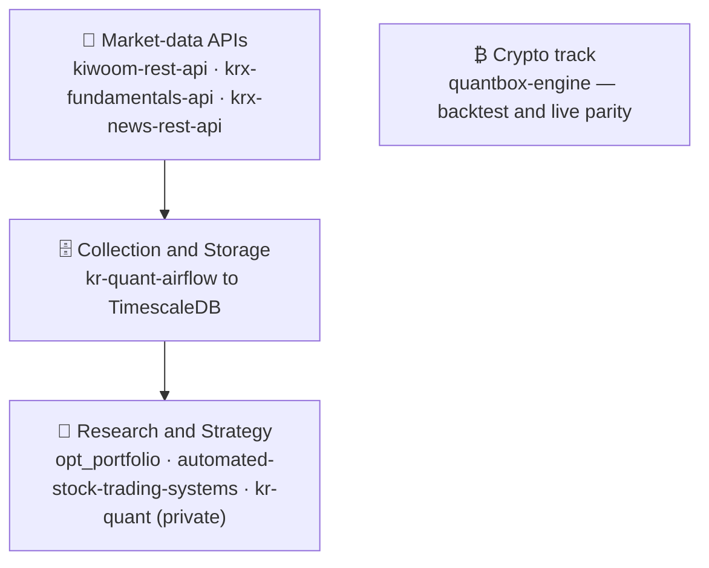

<h1 align="center">Hi, I'm Younghwan Chae 👋</h1>

  <b>PhD in Mechanical Engineering · Mathematical Optimization</b> 
  ML &amp; Perception Engineer building 3D perception &amp; sensor fusion for robotics — 
  and, in my own time, a full quant stack for Korean &amp; crypto markets.

  
  
  

---

### 🧭 About me

- 🎓 **PhD, Mechanical Engineering** (University of Pretoria) — research in **mathematical optimization**: gradient-only line searches (GOALS), surrogate modeling, optimal sensor placement. All degrees *Cum Laude*.
- 🤖 **ML &amp; Perception Engineer @ Doosan Robotics** — 3D perception, sensor fusion, and MLOps for robotics &amp; autonomous systems (camera · radar · LiDAR).
- 📈 In my own time, I build **quant research tooling** for Korean equities and crypto — a full stack from raw market APIs to backtests, with a focus on **lookahead-safe data** and **reproducible backtests**.
- 📝 **10 patents** · **6 peer-reviewed publications** (IEEE Sensors, Springer Nature, Elsevier).

### 🗺️ How my projects fit together

My open-source repos form one **Korean-market quant stack** — raw market APIs feed a
collection pipeline into TimescaleDB, which the research layer reads — plus a separate
**crypto** track.

### 🔭 Open-source projects

**🇰🇷 Korean-market quant stack**

| Layer | Project | What it is |
|---|---|---|
| 🔌 API | **[kiwoom-rest-api](https://github.com/younghwan91/kiwoom-rest-api)** ⭐7 | Python wrapper for the Kiwoom Securities REST API — 207 KR-stock endpoints + real-time WebSocket |
| 🔌 API | **[krx-fundamentals-api](https://github.com/younghwan91/krx-fundamentals-api)** | Corporate fundamentals REST API (DART + KRX + Naver) — financials, valuation, dividends, screening |
| 🔌 API | **[krx-news-rest-api](https://github.com/younghwan91/krx-news-rest-api)** | Market news &amp; disclosure collection REST API (FastAPI + Redis) |
| 🗄️ Pipeline | **[kr-quant-airflow](https://github.com/younghwan91/kr-quant-airflow)** | Airflow pipeline collecting prices/flows/earnings/consensus into TimescaleDB |
| 🧪 Research | **[opt_portfolio](https://github.com/younghwan91/opt_portfolio)** ⭐2 | VAA-based tactical asset-allocation / portfolio management |
| 🧪 Research | **[automated-stock-trading-systems](https://github.com/younghwan91/automated-stock-trading-systems)** | Backtester for the 7 non-correlated systems from Bensdorp's *Automated Stock Trading Systems* |

**₿ Crypto**

| Project | What it is |
|---|---|
| **[quantbox-engine](https://github.com/younghwan91/quantbox-engine)** | Strategy-agnostic crypto futures backtest &amp; execution engine — guaranteed zero lookahead, backtest↔live parity |

### 🛠️ Tech

  
  
  
  
  
  
  
  
  
  
  
  
  

### 📊 GitHub

  
  

