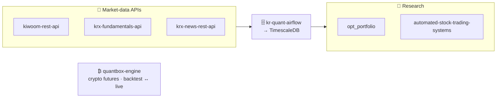

<h1 align="center">Younghwan Chae</h1>

  <b>PhD in Mechanical Engineering</b> <i>(Mathematical Optimization)</i> &nbsp;·&nbsp; ML &amp; Perception Engineer <b>@ Doosan Robotics</b> 
  3D perception &amp; sensor fusion for robotics and autonomous systems — grounded in optimization, shipped to production.

  
  
  

  

  <b>Mathematical Optimization</b> · 3D Perception &amp; Sensor Fusion · Camera · Radar · LiDAR · MLOps · Quantitative Research

---

### 🧠 Background

- 🎓 **PhD in Mechanical Engineering**, specialized in **mathematical optimization** — numerical optimization, surrogate modeling, state estimation (all degrees *Cum Laude*)
- 🤖 **ML &amp; Perception Engineer @ Doosan Robotics** (prev. bitsensing) — 3D perception, sensor fusion &amp; robotics AI across **camera · radar · LiDAR**
- 🏭 Shipped camera/radar/LiDAR **multi-sensor perception to mass production** — 200+ deployments across 8 countries, −51% fusion error · **10 patents · 6 peer-reviewed papers**
- 📈 On the side, I build a full open-source **quant stack** — market-data APIs, a collection pipeline, and backtesting engines

### 🔭 Open-source

Market-data APIs feed a collection pipeline into TimescaleDB that the research layer reads — plus a standalone, live-parity crypto engine.

| Project | What it is |
|---|---|
| **[kiwoom-rest-api](https://github.com/younghwan91/kiwoom-rest-api)** | Kiwoom Securities REST API wrapper — 207 endpoints + real-time WebSocket |
| **[quantbox-engine](https://github.com/younghwan91/quantbox-engine)** | Crypto futures backtest &amp; execution engine — zero lookahead, backtest↔live parity |
| **[kr-quant-airflow](https://github.com/younghwan91/kr-quant-airflow)** | Airflow pipeline collecting Korean market data into TimescaleDB |
| **[krx-fundamentals-api](https://github.com/younghwan91/krx-fundamentals-api)** | Korean corporate fundamentals API (DART + KRX + Naver) |
| **[opt_portfolio](https://github.com/younghwan91/opt_portfolio)** | VAA-based tactical asset allocation |
| **[automated-stock-trading-systems](https://github.com/younghwan91/automated-stock-trading-systems)** | Backtester for Bensdorp's 7 non-correlated systems |

🔒 **Also private** — equity screeners (Wyckoff accumulation · Minervini + VCP), a statistical-arbitrage crypto engine, and live trading systems. *Available on request.*

### 🛠️ Tech

  
  
  
  
  
  
  
  
  
  
  

