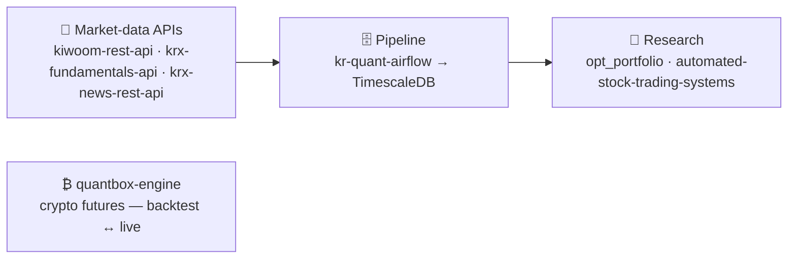

<h1 align="center">Younghwan Chae</h1>

  <b>Mathematical Optimization PhD</b> &nbsp;·&nbsp; Quantitative Research &amp; Applied ML 
  Turning noisy, non-stationary market signals into alpha — optimization &amp; signal-processing rigor, backed by production trading infrastructure.

  
  
  

  

  <b>Mathematical Optimization</b> · Bayesian State Estimation · Signal Processing · Backtesting Infrastructure · Deep Learning

---

### 🗺️ Open-source quant stack — built end to end

Raw market-data APIs feed a collection pipeline into TimescaleDB that the research layer reads — plus a standalone, live-parity crypto engine.

| Project | What it is |
|---|---|
| **[quantbox-engine](https://github.com/younghwan91/quantbox-engine)** | Crypto futures backtest &amp; execution engine — zero lookahead, backtest↔live parity |
| **[kiwoom-rest-api](https://github.com/younghwan91/kiwoom-rest-api)** | Kiwoom Securities REST API wrapper — 207 endpoints + real-time WebSocket |
| **[kr-quant-airflow](https://github.com/younghwan91/kr-quant-airflow)** | Airflow pipeline collecting Korean market data into TimescaleDB |
| **[krx-fundamentals-api](https://github.com/younghwan91/krx-fundamentals-api)** | Korean corporate fundamentals API (DART + KRX + Naver) |
| **[opt_portfolio](https://github.com/younghwan91/opt_portfolio)** | VAA-based tactical asset allocation |
| **[automated-stock-trading-systems](https://github.com/younghwan91/automated-stock-trading-systems)** | Backtester for Bensdorp's 7 non-correlated systems |

### 🧠 Background

- 🎯 **PhD in numerical optimization** — non-linear optimization, surrogate modeling &amp; Bayesian state estimation for noisy, non-stationary signals (all degrees *Cum Laude*)
- 🛰️ Applied ML at **production scale** @ Doosan Robotics / bitsensing — multi-sensor fusion &amp; radar signal processing shipped to mass production (**200+ deployments, 8 countries**) · **10 patents · 6 peer-reviewed papers**
- ⚙️ **Trading infrastructure** — live crypto execution engine, lookahead-safe backtesting with overfitting guards, high-frequency market-data pipelines

### 🛠️ Tech

  
  
  
  
  
  
  
  
  
  

