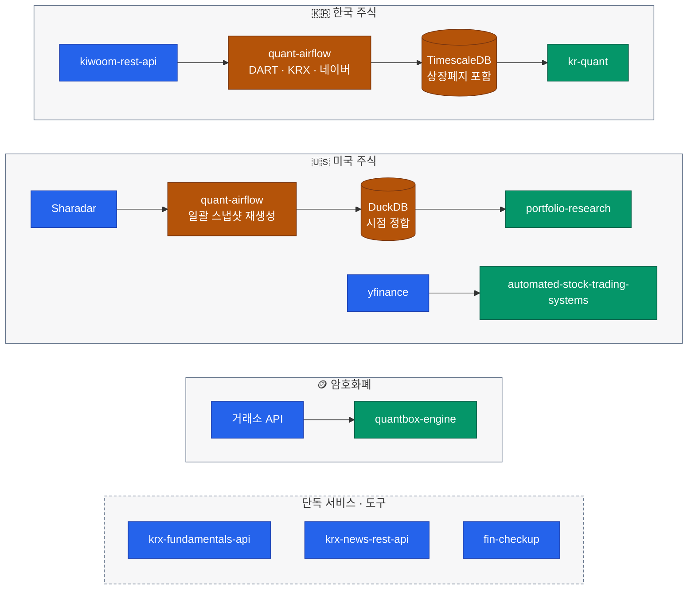

<h1 align="center">Younghwan Chae, Ph.D. · 채영환</h1>

  <b>기계공학 박사</b> &nbsp;—&nbsp; <b><i>수치 최적화</i></b> &nbsp;·&nbsp; <b>두산로보틱스</b> ML · 인지 엔지니어 
<b>학위 때부터 붙잡고 있는 건 결국 최적화 하나다.</b> 수치 최적화와 대리모델, 상태추정으로 시작해 지금은 3D 인지와 센서 퓨전, 양산 시스템에 그걸 쓴다.

<b>한국어</b> · <a href="README.en.md">English</a>

  
  
  

---

<h3></h3>

- 🎓 **기계공학 박사.** 학사·석사·박사를 모두 *우등으로* 마쳤다
- 🤖 **두산로보틱스**에서 ML·인지 엔지니어로 일한다 (이전 bitsensing). **카메라·레이더·라이다**를 함께 쓰는 3D 인지와 센서 퓨전, 로보틱스 AI 가 맡은 일이다
- 🏭 **다중 센서 인지를 양산까지 보냈다.** 8개국에 200대 넘게 나갔고 퓨전 오차를 51% 줄였다. **특허 10건과 피어리뷰 논문 6편**이 여기서 나왔다
- 📈 퇴근하면 **한국 주식·미국 주식·암호화폐**를 다루는 오픈소스 퀀트 스택을 만든다. 시장 데이터 API 부터 수집 파이프라인, 리서치·백테스트 엔진까지 직접 짰다. **시점 정합(point-in-time)과 생존편향 처리는 전 구간에서 예외를 두지 않는다**
- 🛰️ **웬만한 센서는 다 다뤄 봤다.** RGB·스테레오·구조광 카메라, 4D 이미징 레이더, 라이다, IMU/GPS, 포인트 클라우드와 RF 신호, 3D 스캔, 영상, 그리고 금융 시계열까지

<h3></h3>

세 스택이 같은 뼈대를 쓴다. **수집하고, 저장하고, 그 위에서만 검증한다.**
두 주식 시장은 Airflow 하나를 나눠 쓰고, 단독으로 도는 서비스들은 파이프라인 바깥에 있다.

```mermaid
flowchart TB
    subgraph KR ["🇰🇷 한국 주식"]
        direction LR
        K["kiwoom-rest-api"] --> AF["quant-airflow<br/>DART · KRX · 네이버"] --> DB[("TimescaleDB<br/>상장폐지 포함")] --> Q["kr-quant"]
    end

    subgraph US ["🇺🇸 미국 주식"]
        direction LR
        SH["Sharadar"] --> AFU["quant-airflow<br/>일괄 스냅샷 재생성"] --> DD[("DuckDB<br/>시점 정합")] --> O["portfolio-research"]
        YF["yfinance"] --> AT["automated-stock-trading-systems"]
    end

    subgraph CX ["🪙 암호화폐"]
        direction LR
        EX["거래소 API"] --> CR["quantbox-engine"]
    end

    subgraph SVC ["단독 서비스 · 도구"]
        direction TB
        F["krx-fundamentals-api"]
        NW["krx-news-rest-api"]
        FC["fin-checkup"]
    end

    %% 세로 정렬용 — `~~~` 는 그 자체로 보이지 않는 링크다(linkStyle 불필요).
    KR ~~~ US ~~~ CX ~~~ SVC

    classDef source fill:#2563EB,stroke:#1E40AF,color:#FFFFFF
    classDef move   fill:#B45309,stroke:#78350F,color:#FFFFFF
    classDef out    fill:#059669,stroke:#065F46,color:#FFFFFF

    class K,SH,YF,EX,F,NW,FC source
    class AF,AFU,DB,DD move
    class Q,O,AT,CR out

    style KR  fill:#0F172A08,stroke:#64748B
    style US  fill:#0F172A08,stroke:#64748B
    style CX  fill:#0F172A08,stroke:#64748B
    style SVC fill:#0F172A08,stroke:#64748B,stroke-dasharray:4 3
```

파랑은 데이터 원천과 단독 서비스, 앰버는 수집·저장, 초록은 리서치·엔진이다. 점선은 파이프라인 바깥을 뜻한다.

| 프로젝트 | 무엇인가 |
|---|---|
| **[kiwoom-rest-api](https://github.com/younghwan91/kiwoom-rest-api)**  | 키움증권 REST API 를 파이썬으로 감싼 라이브러리. 국내주식 엔드포인트를 빠짐없이 덮고 실시간 WebSocket 도 받는다. sync 와 async 를 모두 지원하고 토큰은 알아서 갱신한다. 예전 OpenAPI+ 처럼 32bit 윈도우에 묶이지 않아 리눅스 서버에서 그대로 돈다 · **`pip install kiwoom-client`**  |
| **[quant-airflow](https://github.com/younghwan91/quant-airflow)**  | 두 주식 스택에 데이터를 대는 파이프라인. 한국 쪽은 시세·수급·실적·컨센서스·상장주식수를 DART·키움·KRX·네이버에서 모아 TimescaleDB 에 쌓는다. **상장폐지 종목까지 되살려 담기 때문에** 이 데이터로 만든 백테스트는 생존편향에 빠지지 않는다. 미국 쪽은 Sharadar 스냅샷을 매일 통째로 받아 DuckDB 스토어를 새로 만든 뒤 한 번에 갈아끼운다 |
| **[krx-fundamentals-api](https://github.com/younghwan91/krx-fundamentals-api)**  | 국내 기업 펀더멘탈을 REST 로 내주는 API. 재무제표와 투자지표, 배당, 종목 스크리닝을 DART·KRX·네이버에서 모은다. 스케줄러가 미리 채워 두므로 요청이 들어와도 원천까지 가지 않는다 |
| **[krx-news-rest-api](https://github.com/younghwan91/krx-news-rest-api)**  | 한국 주식 뉴스와 공시를 모아 주는 API (FastAPI + Redis). 매체마다 같은 사건을 조금씩 다르게 쓰는데, 그걸 한 스키마로 눕혀서 내준다 |
| **[fin-checkup](https://github.com/younghwan91/fin-checkup)**  | 관심 종목에 유상증자·전환사채·감사의견·상장폐지 같은 위험 공시가 뜨면 텔레그램으로 알린다. 재무 17개 지표는 작년 값, 업종 중앙값, 동종업계 백분위와 나란히 놓아 신호등으로 보여준다. DART 와 SEC 양쪽을 본다. **재무 수치와 사실만 전하고 종목 추천은 하지 않는다** |
| **[kr-quant](https://github.com/younghwan91/kr-quant)**  | 코스피·코스닥 알파를 심사한다. walk-forward, 랜덤 음성대조, purged CV, Deflated Sharpe, 생존편향 보정 유니버스를 **CI 가 전부 검사하므로 빠뜨릴 수가 없다**. **여기서 나오는 건 대개 기각이고, 그게 이 저장소의 산출물이다.** 아무 신호도 없는 난수가 “6폴드 중 5폴드 양수”를 46% 확률로 통과하니, 판별 기준은 폴드 개수가 아니라 자기 자신의 무작위 버전을 이기느냐다. 일일 섹터 자금흐름을 재는 축도 같이 있다 |
| **[portfolio-research](https://github.com/younghwan91/portfolio-research)**  | 미국주식 팩터 엔진. 시점이 어긋나지 않고 생존편향을 보정한 데이터 위에서만 walk-forward 를 돌리고, 그 결과를 **Deflated Sharpe 와 PBO** 로 거른다. ETF 전술배분도 같이 검증한다. **통과한 것만 싣지는 않는다.** 사전등록한 TAA 9건은 전부 PBO 관문을 못 넘었고, 표제로 쓰던 숫자 하나는 스스로 철회했다 · [writeup](https://younghwan91.github.io/portfolio-research/) |
| **[quantbox-engine](https://github.com/younghwan91/quantbox-engine)**  | 암호화폐 선물 백테스트·실행 엔진. 전략이 받는 배열에 미래 봉이 애초에 안 들어가고, 같은 전략 객체가 백테스트와 실거래를 그대로 탄다. 청산 주문은 거래소에 미리 걸어 두므로 봇이 죽어도 남는다 |
| **[automated-stock-trading-systems](https://github.com/younghwan91/automated-stock-trading-systems)**  | Bensdorp 의 비상관 트레이딩 시스템 7개를 교육용으로 다시 구현한 백테스터. 일곱을 함께 돌리면 상관이 낮아진다는 주장을 그대로 확인해 본다 |

<h3></h3>

전략과 파라미터는 열지 않는다. 어떻게 굴러가는지, 어떤 규율을 지키는지만 적었다. **궁금하시면 따로 설명해 드린다.**

| 프로젝트 | 무엇인가 |
|---|---|
| **macro-sector-agent**  | 하향식으로 산업 테마를 찾는 리서치 파이프라인. “지금 뭘 사야 하나”가 아니라 “**지금 어느 산업이 잊혔나**”를 먼저 묻는다. 표준 섹터 분류로는 안 보이는 해상도로 시장을 쪼갠다. 사이클 저점인지 그냥 죽어가는 산업인지는 에이전트가 증거를 놓고 다툰다. **LLM 은 파이프라인의 좁은 허리에만 두고** 위아래는 전부 결정론으로 짰다. 기계는 종목을 고르지 않고 빼기만 한다 |
| **scalp-it**  | 국내 단타 전략을 검증하는 프레임워크와 장중 실시간 틱·호가 수집기. 틱은 나중에 받아올 방법이 없어서 그날 놓치면 영원히 없다. **사전등록하고 딱 한 번만 잰다.** 기각된 걸 살리려고 파라미터를 바꾸지 않는다 |
| **quantbox**  | 암호화폐 페어 트레이딩 엔진. 통계적 차익거래를 다룬다. 공개된 `quantbox-engine` 은 여기서 전략만 걷어낸 것이다 |
| **momentum**  | 미국주식 스크리너. Minervini 추세 템플릿과 VCP 패턴을 DuckDB 캐시 위에 올려 CLI 로 돌린다 |
| **gpt-quant-v2**  | 뉴스로 매매 신호를 만들어 본 실험. 감성 분석과 ML 을 붙이고 MCP 도구로 노출했다 (지금은 아카이브) |
| **trading_code**  | 암호화폐 페어 트레이딩 프레임워크의 첫 판. `quantbox` 가 여기서 나왔다 (아카이브) |
| **resume-private**  | 이력서 비공개 원본 (LaTeX) |

<h3></h3>

  
  
  
  
  
  
  
  
  
  
  

