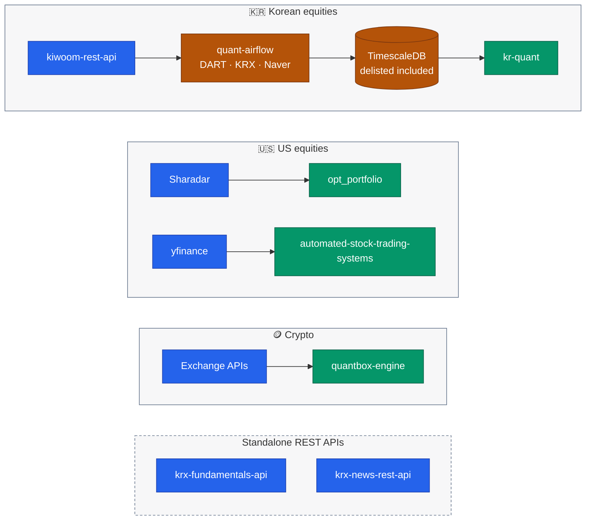

<h1 align="center">Younghwan Chae, Ph.D. · 채영환</h1>

  <b>PhD in Mechanical Engineering</b> &nbsp;—&nbsp; <b><i>Mathematical Optimization</i></b> &nbsp;·&nbsp; ML &amp; Perception Engineer <b>@ Doosan Robotics</b> 
  <b>Mathematical optimization is the through-line</b> — numerical optimization, surrogate modeling &amp; state estimation, carried from theory into 3D perception, sensor fusion, and production systems.

  
  
  

---

<h3></h3>

- 🎓 **PhD in Mechanical Engineering** — all degrees *Cum Laude*
- 🤖 **ML &amp; Perception Engineer @ Doosan Robotics** (prev. bitsensing) — 3D perception, sensor fusion &amp; robotics AI across **camera · radar · LiDAR**
- 🏭 Shipped **multi-sensor perception to mass production** — 200+ deployments across 8 countries, −51% fusion error · **10 patents · 6 peer-reviewed papers**
- 📈 On the side, I build a full open-source **quant stack** across **Korean equities · US equities · crypto** — market-data APIs, a collection pipeline, and research &amp; backtesting engines, with point-in-time data and survivorship-bias handling throughout
- 🛰️ **Every sensor, every modality** — RGB/stereo/structured-light cameras, 4D imaging radar, LiDAR, IMU/GPS, point clouds &amp; RF signals, 3D scans, video, and financial time-series; few data types I haven't shipped with

<h3></h3>

Three stacks that share a shape — **collect → store → research** — but only the Korean one needs all three stages. The two REST APIs are standalone services, not pipeline inputs.

```mermaid
flowchart TB
    subgraph KR ["🇰🇷 Korean equities"]
        direction LR
        K["kiwoom-rest-api"] --> AF["quant-airflow<br/>DART · KRX · Naver"] --> DB[("TimescaleDB<br/>delisted included")] --> Q["kr-quant"]
    end

    subgraph US ["🇺🇸 US equities"]
        direction LR
        SH["Sharadar"] --> O["opt_portfolio"]
        YF["yfinance"] --> AT["automated-stock-trading-systems"]
    end

    subgraph CX ["🪙 Crypto"]
        direction LR
        EX["Exchange APIs"] --> CR["quantbox-engine"]
    end

    subgraph SVC ["Standalone REST APIs"]
        direction TB
        F["krx-fundamentals-api"]
        NW["krx-news-rest-api"]
    end

    %% 세로 정렬용 — `~~~` 는 그 자체로 보이지 않는 링크다(linkStyle 불필요).
    KR ~~~ US ~~~ CX ~~~ SVC

    classDef source fill:#2563EB,stroke:#1E40AF,color:#FFFFFF
    classDef move   fill:#B45309,stroke:#78350F,color:#FFFFFF
    classDef out    fill:#059669,stroke:#065F46,color:#FFFFFF

    class K,SH,YF,EX,F,NW source
    class AF,DB move
    class Q,O,AT,CR out

    style KR  fill:#0F172A08,stroke:#64748B
    style US  fill:#0F172A08,stroke:#64748B
    style CX  fill:#0F172A08,stroke:#64748B
    style SVC fill:#0F172A08,stroke:#64748B,stroke-dasharray:4 3
```

Blue — data sources · amber — collection &amp; storage · green — research &amp; engines. Dashed — standalone services.

| Project | What it is |
|---|---|
| **[kiwoom-rest-api](https://github.com/younghwan91/kiwoom-rest-api)**  | Kiwoom Securities REST API wrapper — 186 endpoints (182 REST + 4 condition-search) &amp; 19 real-time WebSocket feeds · sync + async, auto token refresh · **`pip install kiwoom-client`**  |
| **[quantbox-engine](https://github.com/younghwan91/quantbox-engine)**  | Crypto futures backtest &amp; execution engine — zero lookahead, backtest↔live parity |
| **[quant-airflow](https://github.com/younghwan91/quant-airflow)**  | Airflow pipeline collecting Korean market data (prices, supply/demand, earnings, consensus, shares outstanding) into TimescaleDB — 11 DAGs over DART · Kiwoom · KRX · Naver, with **delisted-stock backfill** so downstream backtests aren't survivorship-biased |
| **[krx-fundamentals-api](https://github.com/younghwan91/krx-fundamentals-api)**  | Korean corporate fundamentals API — financial statements, valuation metrics, dividends, major shareholders &amp; stock screening (DART + KRX + Naver) |
| **[krx-news-rest-api](https://github.com/younghwan91/krx-news-rest-api)**  | Korean market news &amp; disclosure collection API (FastAPI + Redis) |
| **[kr-quant](https://github.com/younghwan91/kr-quant)**  | KOSPI/KOSDAQ alpha research at the trade-distribution level — walk-forward, random null controls, purged CV, Deflated Sharpe &amp; survivorship-corrected universes, all **enforced as CI guardrails**. Findings so far: alpha splits into **convex** (tail-driven) vs **diffuse** types; PEAD is the validated diffuse one; and restoring delisted names *raised* its excess return — survivorship bias distorts the benchmark more than the strategy |
| **[opt_portfolio](https://github.com/younghwan91/opt_portfolio)**  | US equity factor engine — **158 factors over 21,963 tickers (1997–2026)**, point-in-time &amp; survivorship-bias-free, walk-forward optimization gated by Deflated Sharpe · plus a VAA tactical asset allocation backtester |
| **[automated-stock-trading-systems](https://github.com/younghwan91/automated-stock-trading-systems)**  | Backtester for Bensdorp's 7 non-correlated systems |

🔒 **Also private** — equity screeners (Wyckoff accumulation · Minervini + VCP), a statistical-arbitrage crypto engine, and live trading systems. *Available on request.*

<h3></h3>

  
  
  
  
  
  
  
  
  
  
  

