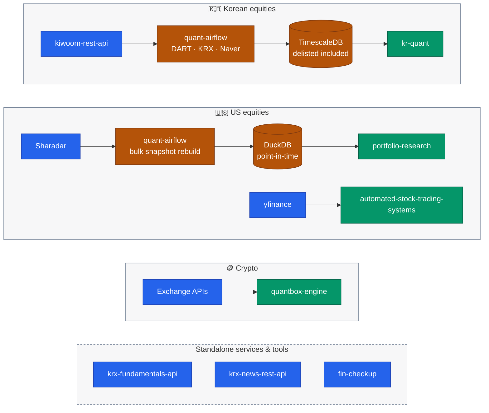

<h1 align="center">Younghwan Chae, Ph.D. · 채영환</h1>

  <b>PhD in Mechanical Engineering</b> &nbsp;—&nbsp; <b><i>Mathematical Optimization</i></b> &nbsp;·&nbsp; ML &amp; Perception Engineer <b>@ Doosan Robotics</b> 
  <b>Mathematical optimization is the through-line</b> — numerical optimization, surrogate modeling &amp; state estimation, carried from theory into 3D perception, sensor fusion, and production systems.

<a href="README.ko.md">한국어</a> · <b>English</b>

  
  
  

---

<h3></h3>

Three stacks that share a shape — **collect → store → research**. One Airflow deployment feeds both equity markets; the standalone services sit outside the pipeline.

```mermaid
flowchart TB
    subgraph KR ["🇰🇷 Korean equities"]
        direction LR
        K["kiwoom-rest-api"] --> AF["quant-airflow<br/>DART · KRX · Naver"] --> DB[("TimescaleDB<br/>delisted included")] --> Q["kr-quant"]
    end

    subgraph US ["🇺🇸 US equities"]
        direction LR
        SH["Sharadar"] --> AFU["quant-airflow<br/>bulk snapshot rebuild"] --> DD[("DuckDB<br/>point-in-time")] --> O["portfolio-research"]
        YF["yfinance"] --> AT["automated-stock-trading-systems"]
    end

    subgraph CX ["🪙 Crypto"]
        direction LR
        EX["Exchange APIs"] --> CR["quantbox-engine"]
    end

    subgraph SVC ["Standalone services & tools"]
        direction TB
        F["krx-fundamentals-api"]
        NW["krx-news-rest-api"]
        FC["fin-checkup"]
    end

    %% 세로 정렬용 — `~~~` 는 그 자체로 보이지 않는 링크다(linkStyle 불필요).
    KR ~~~ US ~~~ CX ~~~ SVC

    classDef source fill:#2563EB,stroke:#1E40AF,color:#FFFFFF
    classDef move   fill:#B45309,stroke:#78350F,color:#FFFFFF
    classDef out    fill:#059669,stroke:#065F46,color:#FFFFFF

    class K,SH,YF,EX,F,NW,FC source
    class AF,AFU,DB,DD move
    class Q,O,AT,CR out

    style KR  fill:#0F172A08,stroke:#64748B
    style US  fill:#0F172A08,stroke:#64748B
    style CX  fill:#0F172A08,stroke:#64748B
    style SVC fill:#0F172A08,stroke:#64748B,stroke-dasharray:4 3
```

Blue — data sources &amp; standalone services · amber — collection &amp; storage · green — research &amp; engines. Dashed — outside the pipeline.

| Project | What it is |
|---|---|
| **[kiwoom-rest-api](https://github.com/younghwan91/kiwoom-rest-api)**  | Kiwoom Securities REST API wrapper — full domestic-equity endpoint coverage &amp; real-time WebSocket feeds · sync + async, auto token refresh · **`pip install kiwoom-client`**  |
| **[quant-airflow](https://github.com/younghwan91/quant-airflow)**  | The one pipeline behind both equity stacks — 12 DAGs. Korea: prices, supply/demand, earnings, consensus &amp; shares outstanding into TimescaleDB over DART · Kiwoom · KRX · Naver, with **delisted-stock backfill** so downstream backtests aren't survivorship-biased. US: a daily Sharadar bulk snapshot rebuilt into a DuckDB store and published atomically |
| **[krx-fundamentals-api](https://github.com/younghwan91/krx-fundamentals-api)**  | Korean corporate fundamentals API — financial statements, valuation metrics, dividends &amp; stock screening (DART + KRX + Naver), served cache-first |
| **[krx-news-rest-api](https://github.com/younghwan91/krx-news-rest-api)**  | Korean market news &amp; disclosure collection API (FastAPI + Redis) — one schema over sources that each word the same event differently |
| **[fin-checkup](https://github.com/younghwan91/fin-checkup)**  | Risk-disclosure alerts + a financial health checkup over **DART &amp; SEC EDGAR** — rights offerings, CB issues, audit opinions and delistings pushed to Telegram; 17 statement metrics read as a traffic-light chart against last year, the sector median and the peer percentile. **Reports measurements and facts only — never a recommendation** |
| **[kr-quant](https://github.com/younghwan91/kr-quant)**  | KOSPI/KOSDAQ alpha research at the trade-distribution level — walk-forward, random null controls, purged CV, Deflated Sharpe &amp; survivorship-corrected universes, all **enforced as CI guardrails**. **The rejections are the product** — pure noise clears “5 of 6 folds positive” 46% of the time, so the test is whether a strategy beats its own randomized version. A daily sector money-flow observation axis lives alongside it |
| **[portfolio-research](https://github.com/younghwan91/portfolio-research)**  | US equity factor engine — point-in-time &amp; survivorship-bias-free, walk-forward optimization gated by **Deflated Sharpe &amp; PBO** · plus tactical ETF allocation. **Ships the rejections too**: all 9 pre-registered TAA configs failed the PBO gate, and one headline number was retracted · [writeup](https://younghwan91.github.io/portfolio-research/) |
| **[quantbox-engine](https://github.com/younghwan91/quantbox-engine)**  | Crypto futures backtest &amp; execution engine — zero lookahead, backtest↔live parity. Exits are placed as exchange-side algo orders |
| **[automated-stock-trading-systems](https://github.com/younghwan91/automated-stock-trading-systems)**  | Backtester for Bensdorp's seven non-correlated trading systems (educational reimplementation) |

<h3></h3>

Strategies and parameters stay closed. Only structure and discipline are written down. **Happy to walk through any of these on request.**

| Project | What it is |
|---|---|
| **macro-sector-agent**  | Top-down sector-cycle research pipeline — it asks **which industry has been forgotten**, not what to buy. The market is cut at a resolution standard sector labels can't show, and agents argue from evidence over whether a theme is a cycle trough or a structural death. **The LLM sits only at the narrow waist**; everything above and below is deterministic. The machine never picks — it only excludes |
| **scalp-it**  | Korean intraday strategy validation framework + live tick/orderbook collection — ticks cannot be backfilled, so a missed day is gone for good. **Pre-register, measure once.** No re-tuning to revive a rejected hypothesis |
| **quantbox**  | Crypto pair-trading engine — statistical arbitrage. `quantbox-engine` is the public extract with the strategies removed |
| **momentum**  | US equity screener — Minervini Trend Template + VCP pattern, DuckDB-cached, CLI-driven |
| **gpt-quant-v2**  | News-driven algorithmic trading experiment — sentiment analysis + ML signal generation over an MCP tool interface (archived) |
| **trading_code**  | First iteration of the crypto pair-trading framework — predecessor of `quantbox` (archived) |
| **resume-private**  | Private résumé source (LaTeX) |

<h3></h3>

  
  
  
  
  
  
  
  
  
  
  

