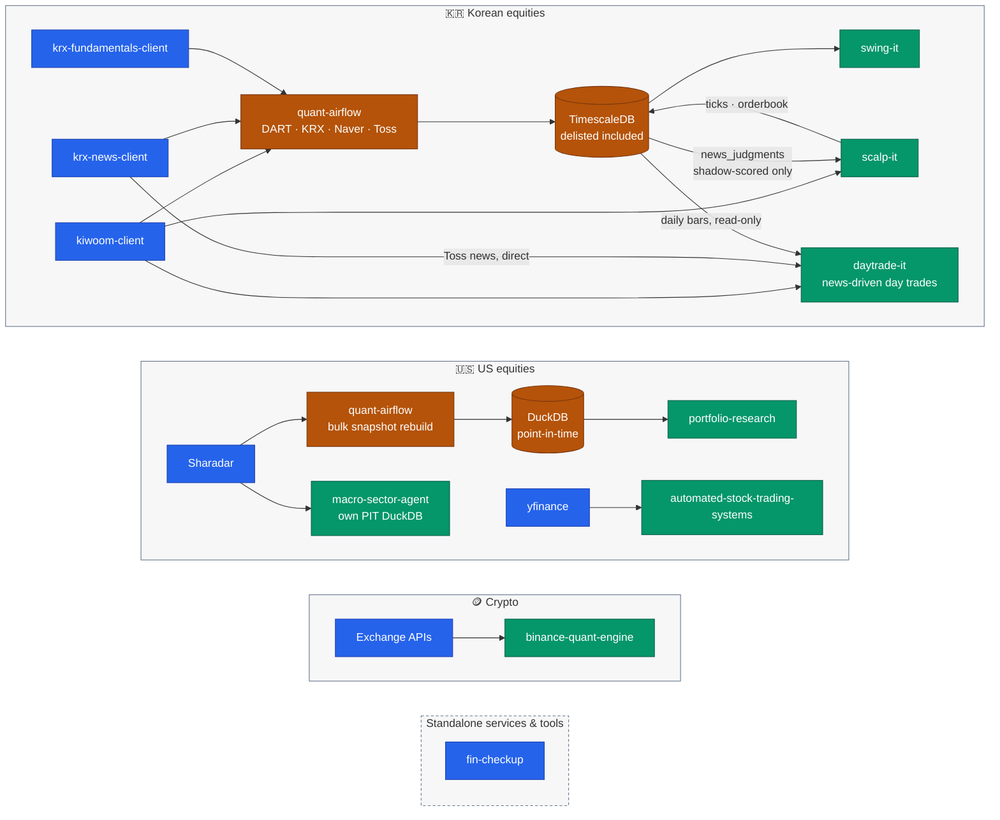
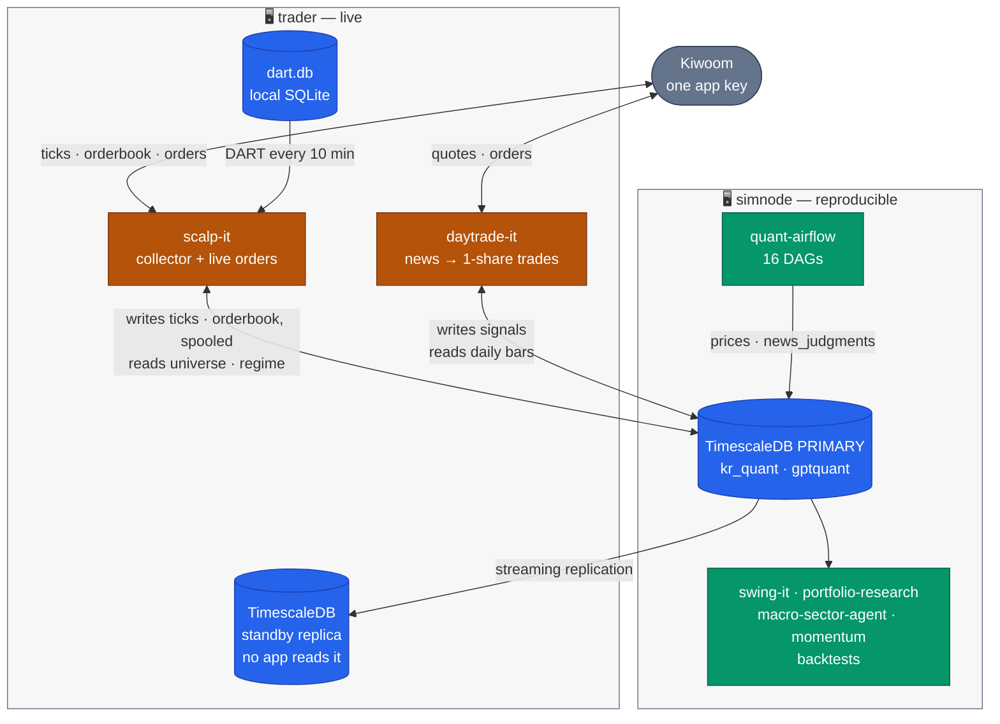
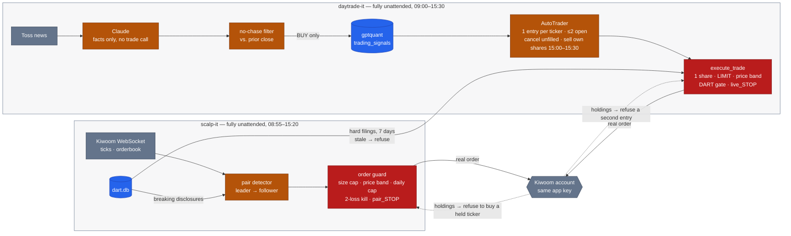

<h1 align="center">Younghwan Chae, Ph.D. · 채영환</h1>

  <b>PhD in Mechanical Engineering</b> &nbsp;—&nbsp; <b><i>Mathematical Optimization</i></b> &nbsp;·&nbsp; ML &amp; Perception Engineer <b>@ Doosan Robotics</b> 
  <b>Mathematical optimization is the through-line</b> — numerical optimization, surrogate modeling &amp; state estimation, carried from theory into 3D perception, sensor fusion, and production systems.

<a href="README.ko.md">한국어</a> · <b>English</b>

  
  
  

---

<h3></h3>

Three stacks that share a shape — **collect → store → research**. One Airflow deployment feeds both equity markets; the standalone services sit outside the pipeline.

```mermaid
flowchart TB
    subgraph KR ["🇰🇷 Korean equities"]
        direction LR
        K["kiwoom-client"] --> AF["quant-airflow<br/>DART · KRX · Naver · Toss"] --> DB[("TimescaleDB<br/>delisted included")] --> Q["swing-it"]
        NW["krx-news-client"] --> AF
        F["krx-fundamentals-client"] --> AF
        K --> SC["scalp-it"]
        SC -- "ticks · orderbook" --> DB
        DB -- "news_judgments<br/>shadow-scored only" --> SC
        K --> KSIG["daytrade-it<br/>news-driven day trades"]
        NW -- "Toss news, direct" --> KSIG
        DB -- "daily bars, read-only" --> KSIG
    end

    subgraph US ["🇺🇸 US equities"]
        direction LR
        SH["Sharadar"] --> AFU["quant-airflow<br/>bulk snapshot rebuild"] --> DD[("DuckDB<br/>point-in-time")] --> O["portfolio-research"]
        SH --> MS["macro-sector-agent<br/>own PIT DuckDB"]
        YF["yfinance"] --> AT["automated-stock-trading-systems"]
    end

    subgraph CX ["🪙 Crypto"]
        direction LR
        EX["Exchange APIs"] --> CR["binance-quant-engine"]
    end

    subgraph SVC ["Standalone services & tools"]
        direction TB
        FC["fin-checkup"]
    end

    %% 세로 정렬용 — `~~~` 는 그 자체로 보이지 않는 링크다(linkStyle 불필요).
    KR ~~~ US ~~~ CX ~~~ SVC

    classDef source fill:#2563EB,stroke:#1E40AF,color:#FFFFFF
    classDef move   fill:#B45309,stroke:#78350F,color:#FFFFFF
    classDef out    fill:#059669,stroke:#065F46,color:#FFFFFF

    class K,SH,YF,EX,F,NW,FC source
    class AF,AFU,DB,DD move
    class Q,O,AT,CR,SC,MS,KSIG out

    style KR  fill:#0F172A08,stroke:#64748B
    style US  fill:#0F172A08,stroke:#64748B
    style CX  fill:#0F172A08,stroke:#64748B
    style SVC fill:#0F172A08,stroke:#64748B,stroke-dasharray:4 3
```

Blue — data sources &amp; standalone services · amber — collection &amp; storage · green — research &amp; engines. Dashed — outside the pipeline.

| Project | What it is |
|---|---|
| **[kiwoom-client](https://github.com/younghwan91/kiwoom-client)**  | Kiwoom Securities REST API wrapper — full domestic-equity endpoint coverage &amp; real-time WebSocket feeds · sync + async, auto token refresh · ships an **MCP server** exposing all 182 REST endpoints plus `condition_search` as AI-agent tools, real-order calls opt-in only · **`pip install kiwoom-client`**  |
| **[quant-airflow](https://github.com/younghwan91/quant-airflow)**  | The one pipeline behind both equity stacks — 16 DAGs. Korea: prices, supply/demand, earnings, consensus, shares outstanding &amp; news/disclosures (via krx-fundamentals-client &amp; krx-news-client) into TimescaleDB over DART · Kiwoom · KRX · Naver · Toss, with **delisted-stock backfill** so downstream backtests aren't survivorship-biased. Structured LLM judgments over that news/disclosure stream (event type, sentiment, staleness) land in `news_judgments` — scalp-it scores them in shadow only; none of it reaches an order. US: a daily Sharadar bulk snapshot rebuilt into a DuckDB store and published atomically |
| **[krx-fundamentals-client](https://github.com/younghwan91/krx-fundamentals-client)**  | Korean corporate fundamentals Python client library — financial statements (batched up to 100 tickers/call), valuation metrics, dividends &amp; stock screening (DART + KRX + Naver), no standing server · feeds quant-airflow's earnings/shares/consensus DAGs |
| **[krx-news-client](https://github.com/younghwan91/krx-news-client)**  | Korean market news &amp; disclosure Python client library — DART filings + Toss Securities, one schema over sources that word the same event differently · feeds quant-airflow's `daily_news` DAG · **`pip install krx-news-client`**  |
| **[fin-checkup](https://github.com/younghwan91/fin-checkup)**  | Risk-disclosure alerts + a financial health checkup over **DART &amp; SEC EDGAR** — rights offerings, CB issues, audit opinions and delistings, routed to Telegram — collection and classification are verified on real data, the Telegram send itself not yet; 17 statement metrics read as a traffic-light chart against last year, the sector median and the peer percentile. **Reports measurements and facts only — never a recommendation** |
| **[swing-it](https://github.com/younghwan91/swing-it)**  | KOSPI/KOSDAQ swing research on two axes kept deliberately apart. **Observation** — `sw-flow`, a terminal screen of where money went by sector over 5–120 trading days, and `sw-ledger`, the raw investor-by-sector accounting underneath it; measurements, never a forecast. **Judgment** — alpha research at the trade-distribution level: walk-forward, random null controls, purged CV, Deflated Sharpe &amp; survivorship-corrected universes, all **enforced as CI guardrails**. **The rejections are the product** — pure noise clears “5 of 6 folds positive” 46% of the time, so the test is whether a strategy beats its own randomized version. 5 of 6 alpha hypotheses rejected; PEAD is the one that passed. Formerly `kr-quant` |
| **[portfolio-research](https://github.com/younghwan91/portfolio-research)**  | US equity factor engine — point-in-time &amp; survivorship-bias-free, walk-forward optimization gated by **Deflated Sharpe &amp; PBO** · plus tactical ETF allocation. **Ships the rejections too**: all 9 pre-registered TAA configs failed the PBO gate, and one headline number was retracted · [writeup](https://younghwan91.github.io/portfolio-research/) |
| **[macro-sector-agent](https://github.com/younghwan91/macro-sector-agent)**  | Top-down US sector-cycle research pipeline over its own Sharadar-fed point-in-time DuckDB — it asks **which industry has been forgotten**, not what to buy. The market is cut at a resolution standard sector labels can't show, and an LLM judge argues from evidence over whether a theme is a cycle trough or a structural death, sitting only at that narrow waist — everything above and below is deterministic. **The machine never picks — it only excludes**; strategy parameters stay out of the repo |
| **[binance-quant-engine](https://github.com/younghwan91/binance-quant-engine)**  | Strategy-agnostic Binance USDT-M futures backtest &amp; execution engine — zero lookahead, backtest↔live parity, optional MCP server. Exits are placed as exchange-side algo orders |
| **[automated-stock-trading-systems](https://github.com/younghwan91/automated-stock-trading-systems)**  | Backtester for Bensdorp's seven non-correlated trading systems (educational reimplementation) |

<h3></h3>

Strategies and parameters stay closed. Only structure and discipline are written down. **Happy to walk through any of these on request.**

| Project | What it is |
|---|---|
| **scalp-it**  | Korean intraday strategy validation framework + live tick/orderbook collection + **a live execution loop** — since late August 2026 its detector sends real orders under a hard-capped order size, a price band, a daily order cap and a consecutive-loss kill switch. Ticks cannot be backfilled, so a missed day is gone for good. **Pre-register, measure once.** No re-tuning to revive a rejected hypothesis |
| **quantbox**  | Binance USDT-M futures breakout/momentum system — VR compression squeeze + MA cluster squeeze. Traded live; the live bot is currently paused. `binance-quant-engine` is the public extract with the strategies removed |
| **momentum**  | US equity screener — Minervini Trend Template + VCP pattern, DuckDB-cached, CLI-driven |
| **daytrade-it**  | Korean-equity (KOSPI/KOSDAQ) news day-trading system, the second live trader on `trader` — **unattended real orders from 2026-09-14**. A daemon polls Toss news, has Claude extract **facts only** — is the company the article's subject, is it new, which direction — never a trade call; scoring is code. A BUY needs the stock not to have already run, the same no-chase finding scalp-it reached on its own. That rule was **picked on an outcome-labeled eval with a held-out split**, over a price-only ML model (38.5% vs. a 38.1% baseline) and over asking the model to predict the reaction, which did worse — and the held-out split is only 10 trading days. Execution: 1 share, LIMIT, price band, one entry per ticker per day, at most 2 open, unfilled entries cancelled, and from 15:00 it sells back only the shares it bought, pricing each retry further below the bid through the closing auction. Full-text articles are scored in shadow to collect forward evidence. Entries are refused while scalp-it's DART cache shows a hard-severity filing for the ticker in the past week — delisting risk, embezzlement, rehabilitation — and also while that cache is missing or stale, so the gate can't pass trades silently. Redeveloped from `gpt-quant-v2` |
| **crypto-pair-trading**  | First iteration of the crypto pair-trading framework — predecessor of `quantbox` |
| **resume-private**  | Private résumé source (LaTeX) |

<h3></h3>

Most of these aren't just repos — they're running right now, across **two hosts that share the same repos but not the same job**. One rule draws the line: **what can't be redone stays on `trader`; what can be rerun lives on `simnode`.** Ticks and orderbook snapshots can't be backfilled, so a missed market hour is gone for good — a failed batch is just rerun tomorrow.

```mermaid
flowchart TB
    KW(["Kiwoom<br/>one app key"])

    subgraph T ["🖥️ trader — live"]
        SC["scalp-it<br/>collector + live orders"]
        DT["daytrade-it<br/>news → 1-share trades"]
        DD[("dart.db<br/>local SQLite")]
        RP[("TimescaleDB<br/>standby replica<br/>no app reads it")]
    end

    subgraph S ["🖥️ simnode — reproducible"]
        AF["quant-airflow<br/>16 DAGs"]
        PR[("TimescaleDB PRIMARY<br/>kr_quant · gptquant")]
        RS["swing-it · portfolio-research<br/>macro-sector-agent · momentum<br/>backtests"]
    end

    KW <-->|"ticks · orderbook · orders"| SC
    KW <-->|"quotes · orders"| DT
    DD -->|"DART every 10 min"| SC
    SC <-->|"writes ticks · orderbook, spooled<br/>reads universe · regime"| PR
    DT <-->|"writes signals<br/>reads daily bars"| PR
    AF -->|"prices · news_judgments"| PR
    PR -->|"streaming replication"| RP
    PR --> RS

    classDef live fill:#B45309,stroke:#78350F,color:#FFFFFF
    classDef repro fill:#059669,stroke:#065F46,color:#FFFFFF
    classDef store fill:#2563EB,stroke:#1E40AF,color:#FFFFFF
    classDef ext fill:#64748B,stroke:#334155,color:#FFFFFF

    class SC,DT live
    class AF,RS repro
    class RP,PR,DD store
    class KW ext

    style T fill:#0F172A08,stroke:#64748B
    style S fill:#0F172A08,stroke:#64748B
```

Every arrow into or out of a database crosses the LAN to `simnode` — nothing on `trader` reads its own replica. The replica is there to be promoted, not queried.

| | **`trader`** — the live box | **`simnode`** — the research box |
|---|---|---|
| **Job** | Irreversible, wall-clock bound — market hours happen once | Reproducible — orchestration, batches, research |
| **Runs** | `scalp-it` tick/orderbook collection and live orders · `daytrade-it` news-driven live orders · `quantbox` (paused) · `kiwoom-client` development, because a broker session is one-per-key and it lives here | Airflow scheduler &amp; webserver (16 DAGs) · TimescaleDB **PRIMARY** · `swing-it`, `portfolio-research`, `macro-sector-agent`, `momentum` · post-close research batches · **backtests** |
| **Shared repos** | `quant-airflow` exists here only as a **`git sparse-checkout`** — the replica's compose file, the schema, and the one `.env` every live process sources for broker keys, the Claude key and the DB DSN. Research-only repos aren't here at all | The canonical full clones |
| **TimescaleDB** | Standby streaming replica | PRIMARY — every read and write, from both hosts |

**Two live systems, one broker account.** They trade on different evidence and neither knows the other exists — the account is the only thing they share.

```mermaid
flowchart LR
    subgraph SCP ["scalp-it — fully unattended, 08:55–15:20"]
        WS["Kiwoom WebSocket<br/>ticks · orderbook"] --> DET["pair detector<br/>leader → follower"]
        DART[("dart.db")] -->|"breaking disclosures"| DET
        DET --> GRD["order guard<br/>size cap · price band · daily cap<br/>2-loss kill · pair_STOP"]
    end

    subgraph DTP ["daytrade-it — fully unattended, 09:00–15:30"]
        TOSS["Toss news"] --> CL["Claude<br/>facts only, no trade call"]
        CL --> TC["no-chase filter<br/>vs. prior close"]
        TC -->|"BUY only"| SIG[("gptquant<br/>trading_signals")]
        SIG --> AT["AutoTrader<br/>1 entry per ticker · ≤2 open<br/>cancel unfilled · sell own shares 15:00–15:30"]
        AT --> ET["execute_trade<br/>1 share · LIMIT · price band<br/>DART gate · live_STOP"]
    end

    ACC{{"Kiwoom account<br/>same app key"}}

    DART -->|"hard filings, 7 days<br/>stale → refuse"| ET

    GRD -->|"real order"| ACC
    ET -->|"real order"| ACC
    ACC -. "holdings → refuse to buy a held ticker" .-> GRD
    ACC -. "holdings → refuse a second entry" .-> ET

    classDef live fill:#B45309,stroke:#78350F,color:#FFFFFF
    classDef store fill:#2563EB,stroke:#1E40AF,color:#FFFFFF
    classDef gate fill:#B91C1C,stroke:#7F1D1D,color:#FFFFFF
    classDef ext fill:#64748B,stroke:#334155,color:#FFFFFF

    class DET,CL,TC,AT live
    class DART,SIG store
    class GRD,ET gate
    class WS,TOSS,ACC ext

    style SCP fill:#0F172A08,stroke:#64748B
    style DTP fill:#0F172A08,stroke:#64748B
```

Red — the last check before an order. Dashed — what each side reads back from the account before it buys.

A weekday, in KST:

| Time | `trader` | `simnode` |
|---|---|---|
| **08:30–08:45** | Morning report on yesterday · DART refresh into `dart.db` · two read-only pre-open checks, one per live system | `premarket_news_judgment` — Toss + DART → Claude → `news_judgments` |
| **08:55** | Both launchers start — scalp-it's detector reads today's universe from the PRIMARY; daytrade-it snapshots the account's holdings so it only ever sells what it bought | |
| **09:00–15:20** | scalp-it collects and trades · daytrade-it enters 09:00:30–14:30 and flattens its own shares from 15:00 · DART every 10 min · tick health at 09:10 and 10:00 | `daily_news` and a collection catch-up at 10:05 · Airflow health check at 11:35 |
| **15:20–16:10** | scalp-it stops at 15:20; daytrade-it stops reading news but manages exits through the 15:30 closing auction (15:40 kill as a backstop) · same-day morning report · tick sanity · theme snapshot → PRIMARY | 16:00 `daily_collection`, `daily_earnings` · 16:05 `daily_news` again · news-judgment shadow report |
| **16:55–19:00** | | Price adjustment · consensus · Sharadar (Tue–Sat) · `swing-it` daily report · coverage · Google Drive backup |

- **The same repo on both hosts doesn't make both real.** Config edits are made in `simnode`'s full clone and pushed; `trader` only pulls. A sparse checkout makes that hard to get backwards.
- **Which host is PRIMARY is state, not code** — `pg_is_in_recovery()` answers it, and the answer has already flipped once. The primary started on `trader` so the collector couldn't be killed by a LAN blip; it moved to `simnode` the day the collector grew reconnect + disk spooling and proved itself in production. The demoted host was rebuilt as the replica, compose file name and all.
- **The live box leans on the research box every morning.** Spooling protects ticks going *out*; it does nothing for inputs coming *in*. scalp-it's universe and market regime, and daytrade-it's prior close, are all read from the PRIMARY — built from yesterday's 16:00 collection. If that read fails, scalp-it falls back to a fixed pair list and daytrade-it enters nothing.
- **Two systems, one account, no shared kill switch.** Both ask the broker for holdings before buying and refuse a ticker the account already holds, so whichever enters first owns that ticker until it's closed. They also draw on the same cash, which is why daytrade-it holds at most two positions. And daytrade-it leans on scalp-it: its disclosure gate reads scalp-it's DART cache, so if that cron stops, daytrade-it stops buying. But `pair_STOP` stops only scalp-it, and `live_STOP` stops only daytrade-it's *entries* — its exits keep running, because a kill switch that strands an open position isn't a safety feature.
- **Backtests run on `simnode`, full stop.** `trader`'s CPU belongs to the live daemons, so daytrade-it's backtest entry points check the hostname and refuse to run anywhere else. `swing-it` isn't checked out on `trader` at all anymore.
- **Moving a batch didn't move its clock.** Cron triggers are anchored to when the data is final in the DB, not to the host, so the schedule read identically before and after the split.
- **Backups follow the primary.** After the switch both hosts still ran the Drive backup at 19:00 into date-named files, so whichever finished later won — and that could be `trader`'s stale standby dump. It now runs on `simnode` only.
- The one thing that had to be switched **off**: a health guard that restarts a downed DB container. Left running, it would have resurrected the demoted primary into a split brain. The script stays on disk for the day `trader` hosts the primary again.

<h3></h3>

  
  
  
  
  
  
  
  
  
  
  

