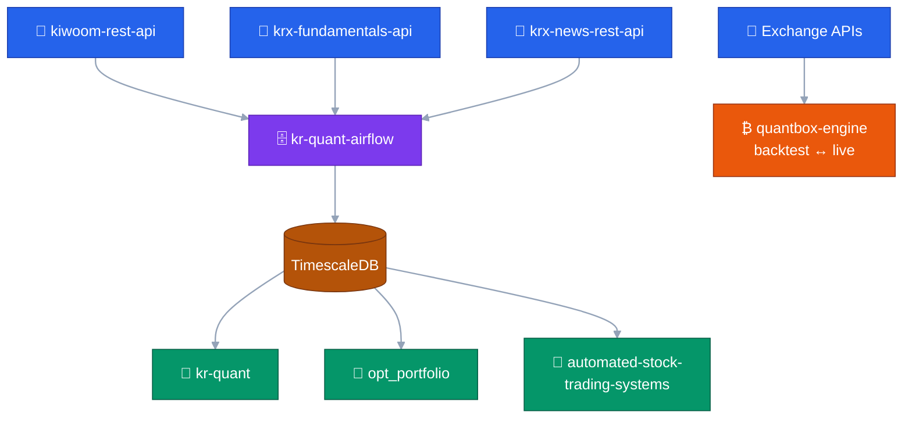

<h1 align="center">Younghwan Chae, Ph.D. · 채영환</h1>

  <b>PhD in Mechanical Engineering</b> &nbsp;—&nbsp; <b><i>Mathematical Optimization</i></b> &nbsp;·&nbsp; ML &amp; Perception Engineer <b>@ Doosan Robotics</b> 
  <b>Mathematical optimization is the through-line</b> — numerical optimization, surrogate modeling &amp; state estimation, carried from theory into 3D perception, sensor fusion, and production systems.

  
  
  

---

<h3></h3>

- 🎓 **PhD in Mechanical Engineering** — all degrees *Cum Laude*
- 🤖 **ML &amp; Perception Engineer @ Doosan Robotics** (prev. bitsensing) — 3D perception, sensor fusion &amp; robotics AI across **camera · radar · LiDAR**
- 🏭 Shipped **multi-sensor perception to mass production** — 200+ deployments across 8 countries, −51% fusion error · **10 patents · 6 peer-reviewed papers**
- 📈 On the side, I build a full open-source **quant stack** — market-data APIs, a collection pipeline, and research &amp; backtesting engines
- 🛰️ **Every sensor, every modality** — RGB/stereo/structured-light cameras, 4D imaging radar, LiDAR, IMU/GPS, point clouds &amp; RF signals, 3D scans, video, and financial time-series; few data types I haven't shipped with

<h3></h3>

Market-data APIs feed a collection pipeline into TimescaleDB that the research layer reads — plus a standalone crypto engine fed straight from exchange APIs.

```mermaid
flowchart TD
    K["🔌 kiwoom-rest-api"] --> AF
    F["🔌 krx-fundamentals-api"] --> AF
    NW["🔌 krx-news-rest-api"] --> AF
    AF["🗄️ kr-quant-airflow"] --> DB[("TimescaleDB")]
    DB --> Q["🧪 kr-quant"]
    DB --> O["🧪 opt_portfolio"]
    DB --> AT["🧪 automated-stock-<br/>trading-systems"]
    EX["🔌 Exchange APIs"] --> CR["₿ quantbox-engine<br/>backtest ↔ live"]

    classDef src    fill:#2563EB,stroke:#1E40AF,stroke-width:1px,color:#FFFFFF
    classDef pipe   fill:#7C3AED,stroke:#5B21B6,stroke-width:1px,color:#FFFFFF
    classDef store  fill:#B45309,stroke:#78350F,stroke-width:1px,color:#FFFFFF
    classDef res    fill:#059669,stroke:#065F46,stroke-width:1px,color:#FFFFFF
    classDef crypto fill:#EA580C,stroke:#9A3412,stroke-width:1px,color:#FFFFFF

    class K,F,NW,EX src
    class AF pipe
    class DB store
    class Q,O,AT res
    class CR crypto

    linkStyle default stroke:#94A3B8,stroke-width:1.5px
```

| Project | What it is |
|---|---|
| **[kiwoom-rest-api](https://github.com/younghwan91/kiwoom-rest-api)**  | Kiwoom Securities REST API wrapper — 207 endpoints + real-time WebSocket |
| **[quantbox-engine](https://github.com/younghwan91/quantbox-engine)**  | Crypto futures backtest &amp; execution engine — zero lookahead, backtest↔live parity |
| **[kr-quant-airflow](https://github.com/younghwan91/kr-quant-airflow)**  | Airflow pipeline collecting Korean market data into TimescaleDB |
| **[krx-fundamentals-api](https://github.com/younghwan91/krx-fundamentals-api)**  | Korean corporate fundamentals API (DART + KRX + Naver) |
| **[krx-news-rest-api](https://github.com/younghwan91/krx-news-rest-api)**  | Korean market news &amp; disclosure collection API (FastAPI + Redis) |
| **[kr-quant](https://github.com/younghwan91/kr-quant)**  | KOSPI/KOSDAQ alpha research — walk-forward, trade-level distributions &amp; random null controls enforced as guardrails |
| **[opt_portfolio](https://github.com/younghwan91/opt_portfolio)**  | VAA-based tactical asset allocation |
| **[automated-stock-trading-systems](https://github.com/younghwan91/automated-stock-trading-systems)**  | Backtester for Bensdorp's 7 non-correlated systems |

🔒 **Also private** — equity screeners (Wyckoff accumulation · Minervini + VCP), a statistical-arbitrage crypto engine, and live trading systems. *Available on request.*

<h3></h3>

  
  
  
  
  
  
  
  
  
  
  

