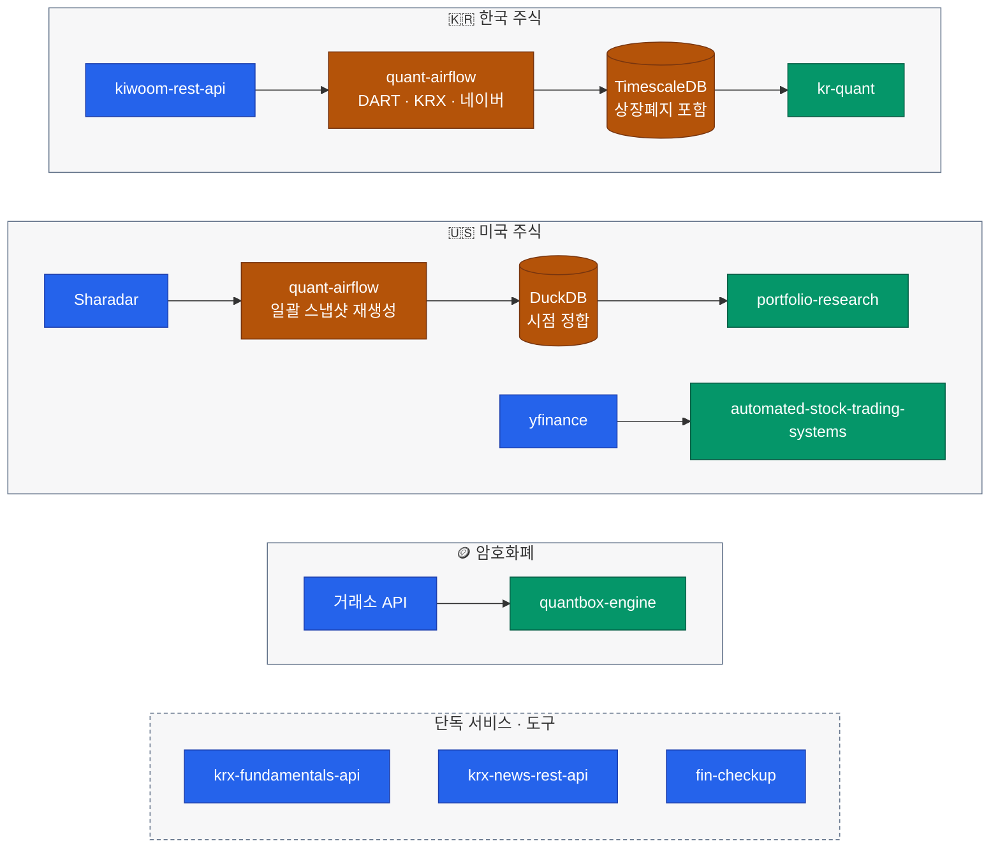

<h1 align="center">Younghwan Chae, Ph.D. · 채영환</h1>

  <b>기계공학 박사</b> &nbsp;—&nbsp; <b><i>수치 최적화</i></b> &nbsp;·&nbsp; <b>두산로보틱스</b> ML · 인지 엔지니어 
<b>일관된 주제는 최적화다</b>. 수치 최적화와 대리모델, 상태추정을 이론에서 3D 인지·센서 퓨전·양산 시스템까지 끌고 왔다.

<b>한국어</b> · <a href="README.en.md">English</a>

  
  
  

---

<h3></h3>

- 🎓 **기계공학 박사** — 학·석·박사 전 과정 *우등 졸업*
- 🤖 **ML · 인지 엔지니어 @ 두산로보틱스** (이전 bitsensing). **카메라 · 레이더 · 라이다**를 아우르는 3D 인지와 센서 퓨전, 로보틱스 AI 를 맡는다
- 🏭 **다중 센서 인지를 양산까지** — 8개국 200+ 배포, 퓨전 오차 −51% · **특허 10건 · 피어리뷰 논문 6편**
- 📈 퇴근 후에는 **한국 주식 · 미국 주식 · 암호화폐**를 아우르는 오픈소스 퀀트 스택을 만든다. 시장 데이터 API, 수집 파이프라인, 리서치·백테스트 엔진까지. **시점 정합(point-in-time)과 생존편향 처리를 전 구간에 강제**한다
- 🛰️ **거의 모든 센서, 거의 모든 모달리티** — RGB·스테레오·구조광 카메라, 4D 이미징 레이더, 라이다, IMU/GPS, 포인트 클라우드와 RF 신호, 3D 스캔, 영상, 그리고 금융 시계열

<h3></h3>

모양이 같은 세 스택: **수집 → 저장 → 리서치**. 두 주식 시장이 Airflow 하나를 나눠 쓰고 단독 서비스는 파이프라인 바깥에 있다.

```mermaid
flowchart TB
    subgraph KR ["🇰🇷 한국 주식"]
        direction LR
        K["kiwoom-rest-api"] --> AF["quant-airflow<br/>DART · KRX · 네이버"] --> DB[("TimescaleDB<br/>상장폐지 포함")] --> Q["kr-quant"]
    end

    subgraph US ["🇺🇸 미국 주식"]
        direction LR
        SH["Sharadar"] --> AFU["quant-airflow<br/>일괄 스냅샷 재생성"] --> DD[("DuckDB<br/>시점 정합")] --> O["portfolio-research"]
        YF["yfinance"] --> AT["automated-stock-trading-systems"]
    end

    subgraph CX ["🪙 암호화폐"]
        direction LR
        EX["거래소 API"] --> CR["quantbox-engine"]
    end

    subgraph SVC ["단독 서비스 · 도구"]
        direction TB
        F["krx-fundamentals-api"]
        NW["krx-news-rest-api"]
        FC["fin-checkup"]
    end

    %% 세로 정렬용 — `~~~` 는 그 자체로 보이지 않는 링크다(linkStyle 불필요).
    KR ~~~ US ~~~ CX ~~~ SVC

    classDef source fill:#2563EB,stroke:#1E40AF,color:#FFFFFF
    classDef move   fill:#B45309,stroke:#78350F,color:#FFFFFF
    classDef out    fill:#059669,stroke:#065F46,color:#FFFFFF

    class K,SH,YF,EX,F,NW,FC source
    class AF,AFU,DB,DD move
    class Q,O,AT,CR out

    style KR  fill:#0F172A08,stroke:#64748B
    style US  fill:#0F172A08,stroke:#64748B
    style CX  fill:#0F172A08,stroke:#64748B
    style SVC fill:#0F172A08,stroke:#64748B,stroke-dasharray:4 3
```

파랑 — 데이터 원천과 단독 서비스 · 앰버 — 수집·저장 · 초록 — 리서치·엔진. 점선 — 파이프라인 바깥.

| 프로젝트 | 무엇인가 |
|---|---|
| **[kiwoom-rest-api](https://github.com/younghwan91/kiwoom-rest-api)**  | 키움증권 REST API 파이썬 라이브러리. 국내주식 엔드포인트를 전수로 덮고 실시간 WebSocket, sync + async, 토큰 자동 갱신까지 담았다. OpenAPI+ 의 32bit·Windows 제약 없이 리눅스 서버에서 그대로 돈다 · **`pip install kiwoom-client`**  |
| **[quant-airflow](https://github.com/younghwan91/quant-airflow)**  | 두 주식 스택에 데이터를 대는 파이프라인 하나, 12개 DAG. 한국은 시세·수급·실적·컨센서스·상장주식수를 DART·키움·KRX·네이버에서 모아 TimescaleDB 로 넣는다. **상장폐지 종목까지 백필**해 하류 백테스트가 생존편향에 빠지지 않게 한다. 미국은 Sharadar 일괄 스냅샷을 매일 DuckDB 스토어로 다시 만들어 원자적으로 발행한다 |
| **[krx-fundamentals-api](https://github.com/younghwan91/krx-fundamentals-api)**  | 국내 기업 펀더멘탈 API. 재무제표·투자지표·배당·종목 스크리닝을 담는다 (DART + KRX + 네이버). 캐시 우선 구조라 요청이 원천까지 가지 않는다 |
| **[krx-news-rest-api](https://github.com/younghwan91/krx-news-rest-api)**  | 한국 주식 뉴스·공시 수집 API (FastAPI + Redis) — 여러 곳이 조금씩 다르게 쓰는 같은 사건을 한 스키마로 통일한다 |
| **[fin-checkup](https://github.com/younghwan91/fin-checkup)**  | 위험 공시 알림 + **DART·SEC** 재무 건강검진. 유상증자·전환사채·감사의견·상장폐지를 텔레그램으로 보낸다. 재무 17개 지표를 작년·업종 중앙값·동종업계 백분위와 나란히 신호등으로 읽어준다. **측정값과 사실만 전달한다 — 추천은 하지 않는다** |
| **[kr-quant](https://github.com/younghwan91/kr-quant)**  | 코스피·코스닥 알파 심사. walk-forward·랜덤 음성대조·purged CV·Deflated Sharpe·생존편향 보정 유니버스를 **전부 CI 가드레일로 강제**한다. **기각이 주된 산출물이다** — 순수 노이즈가 “6폴드 중 5폴드 양수”를 46% 확률로 통과하므로 판별 기준은 폴드 수가 아니라 자기 자신의 무작위 버전을 이기는지다. 일일 섹터 자금흐름 관측 축도 여기에 하나 더 뒀다 |
| **[portfolio-research](https://github.com/younghwan91/portfolio-research)**  | 미국주식 팩터 엔진: point-in-time·생존편향 보정 데이터 위에서 walk-forward 를 **Deflated Sharpe·PBO** 로 게이팅한다. ETF 전술배분도 같이 검증한다. **채택만이 아니라 기각도 싣는다** — 사전등록 TAA 9건이 전부 PBO 게이트를 넘지 못했고 표제 숫자 하나는 스스로 철회했다 · [writeup](https://younghwan91.github.io/portfolio-research/) |
| **[quantbox-engine](https://github.com/younghwan91/quantbox-engine)**  | 암호화폐 선물 백테스트·실행 엔진 — 룩어헤드 0, 같은 전략 객체가 백테스트와 실거래를 그대로 탄다. 청산은 거래소 Algo Order 로 걸어둔다 |
| **[automated-stock-trading-systems](https://github.com/younghwan91/automated-stock-trading-systems)**  | Bensdorp 의 7개 비상관 트레이딩 시스템 백테스터 (교육용 재구현) |

<h3></h3>

전략과 파라미터는 공개하지 않는다. 구조와 규율만 적는다. **요청 시 설명 가능.**

| 프로젝트 | 무엇인가 |
|---|---|
| **macro-sector-agent**  | 하향식 산업 테마 리서치 파이프라인. “지금 뭘 사야 하나”가 아니라 “**지금 어느 산업이 잊혔나**”부터 묻는다. 표준 섹터 분류로는 안 보이는 해상도로 시장을 나눈다. 사이클 저점인지 구조적 사망인지는 에이전트가 증거로 다툰다. **LLM 은 파이프라인의 좁은 허리에만** 있고 위아래는 결정론이다. 기계는 고르지 않고 빼기만 한다 |
| **scalp-it**  | 국내 단타 전략 검증 프레임워크 + 장중 실시간 틱·호가 수집. 틱은 소급 수집이 안 되므로 그날 못 받으면 영원히 없다. **사전등록하고 한 번만 잰다**. 기각된 것을 살리려 파라미터를 바꾸지 않는다 |
| **quantbox**  | 암호화폐 페어 트레이딩 엔진 — 통계적 차익거래. `quantbox-engine` 은 여기서 전략을 걷어낸 공개 추출본이다 |
| **momentum**  | 미국주식 스크리너. Minervini 추세 템플릿과 VCP 패턴을 DuckDB 캐시와 CLI 위에 올렸다 |
| **gpt-quant-v2**  | 뉴스 기반 알고리즘 트레이딩 실험. 뉴스 감성 분석 + ML 신호 생성을 MCP 도구 인터페이스로 묶었다 (아카이브) |
| **trading_code**  | 암호화폐 페어 트레이딩 프레임워크 초기 버전 — `quantbox` 의 전신 (아카이브) |
| **resume-private**  | 이력서 비공개 원본 (LaTeX) |

<h3></h3>

  
  
  
  
  
  
  
  
  
  
  

